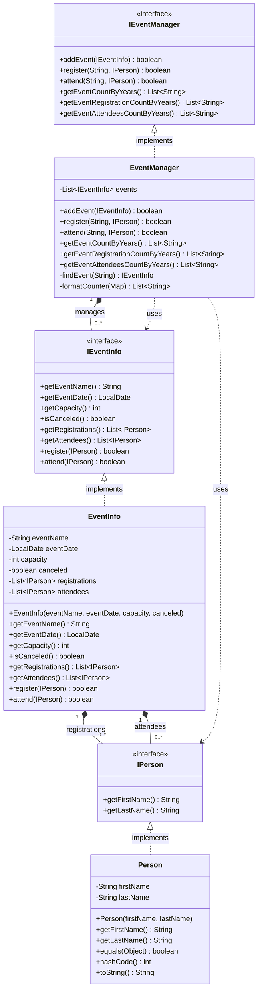

# Event Management System - UML Class Diagram

## PlantUML Diagram

The PlantUML diagram is available in `EventManagementUML.puml`. You can view it using:
- [PlantUML Online Server](http://www.plantuml.com/plantuml/uml/)
- VS Code with PlantUML extension
- IntelliJ IDEA with PlantUML plugin
- Any PlantUML renderer

## Mermaid Diagram



## Text-Based UML Diagram

```
┌─────────────────────────────────────┐
│          <<interface>>              │
│            IPerson                  │
├─────────────────────────────────────┤
│ + getFirstName() : String           │
│ + getLastName() : String            │
└─────────────────────────────────────┘
              ▲
              │ implements
              │
┌─────────────────────────────────────┐
│            Person                    │
├─────────────────────────────────────┤
│ - firstName : String                 │
│ - lastName : String                  │
├─────────────────────────────────────┤
│ + Person(firstName, lastName)        │
│ + getFirstName() : String            │
│ + getLastName() : String             │
│ + equals(Object) : boolean           │
│ + hashCode() : int                    │
│ + toString() : String                │
└─────────────────────────────────────┘

┌─────────────────────────────────────┐
│          <<interface>>              │
│          IEventInfo                 │
├─────────────────────────────────────┤
│ + getEventName() : String            │
│ + getEventDate() : LocalDate         │
│ + getCapacity() : int                │
│ + isCanceled() : boolean             │
│ + getRegistrations() : List<IPerson> │
│ + getAttendees() : List<IPerson>     │
│ + register(IPerson) : boolean        │
│ + attend(IPerson) : boolean          │
└─────────────────────────────────────┘
              ▲
              │ implements
              │
┌─────────────────────────────────────┐
│          EventInfo                   │
├─────────────────────────────────────┤
│ - eventName : String                 │
│ - eventDate : LocalDate              │
│ - capacity : int                     │
│ - canceled : boolean                 │
│ - registrations : List<IPerson>      │
│ - attendees : List<IPerson>          │
├─────────────────────────────────────┤
│ + EventInfo(...)                     │
│ + getEventName() : String            │
│ + getEventDate() : LocalDate         │
│ + getCapacity() : int                │
│ + isCanceled() : boolean             │
│ + getRegistrations() : List<IPerson> │
│ + getAttendees() : List<IPerson>     │
│ + register(IPerson) : boolean        │
│ + attend(IPerson) : boolean          │
└─────────────────────────────────────┘
       │                    │
       │ 1                  │ 1
       │ *                  │ *
       │                    │
       ▼                    ▼
┌──────────────┐    ┌──────────────┐
│  IPerson     │    │  IPerson     │
│ (registrations)│    │ (attendees)  │
└──────────────┘    └──────────────┘

┌─────────────────────────────────────┐
│          <<interface>>              │
│         IEventManager               │
├─────────────────────────────────────┤
│ + addEvent(IEventInfo) : boolean    │
│ + register(String, IPerson) : boolean│
│ + attend(String, IPerson) : boolean │
│ + getEventCountByYears() : List<String>│
│ + getEventRegistrationCountByYears() : List<String>│
│ + getEventAttendeesCountByYears() : List<String>│
└─────────────────────────────────────┘
              ▲
              │ implements
              │
┌─────────────────────────────────────┐
│         EventManager                │
├─────────────────────────────────────┤
│ - events : List<IEventInfo>         │
├─────────────────────────────────────┤
│ + addEvent(IEventInfo) : boolean    │
│ + register(String, IPerson) : boolean│
│ + attend(String, IPerson) : boolean │
│ + getEventCountByYears() : List<String>│
│ + getEventRegistrationCountByYears() : List<String>│
│ + getEventAttendeesCountByYears() : List<String>│
│ - findEvent(String) : IEventInfo    │
│ - formatCounter(Map) : List<String> │
└─────────────────────────────────────┘
       │
       │ 1
       │ *
       ▼
┌──────────────┐
│  IEventInfo  │
│  (manages)   │
└──────────────┘
```

## Key Relationships

1. **Person implements IPerson**: Person class implements the IPerson interface
2. **EventInfo implements IEventInfo**: EventInfo class implements the IEventInfo interface
3. **EventManager implements IEventManager**: EventManager class implements the IEventManager interface
4. **EventInfo has many IPerson (registrations)**: One-to-many relationship for registered persons
5. **EventInfo has many IPerson (attendees)**: One-to-many relationship for attendees
6. **EventManager has many IEventInfo**: One-to-many relationship for managing multiple events
7. **EventManager uses IPerson and IEventInfo**: Dependency relationships for method parameters

## Business Rules

### EventInfo.register()
- Event must not be canceled
- Capacity must not be full
- Person must not already be registered

### EventInfo.attend()
- Event must not be canceled
- Person must be registered
- Person must not already be marked as attendee


